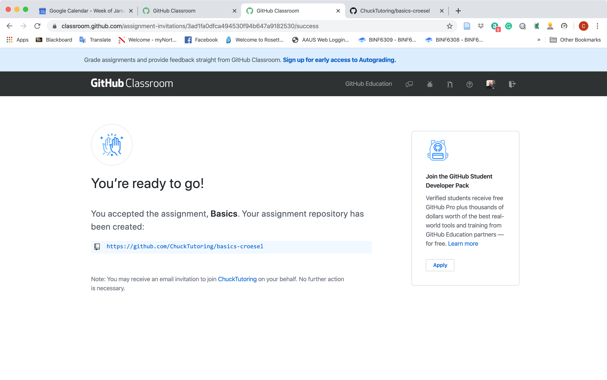
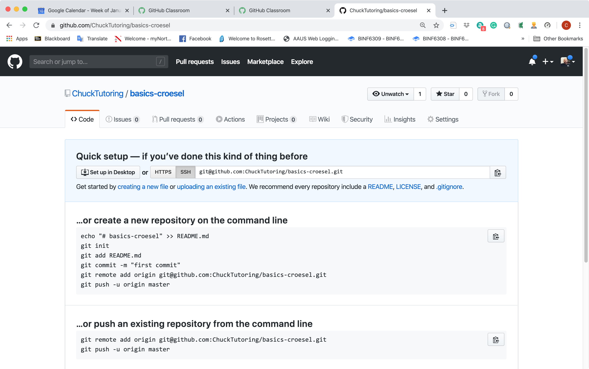
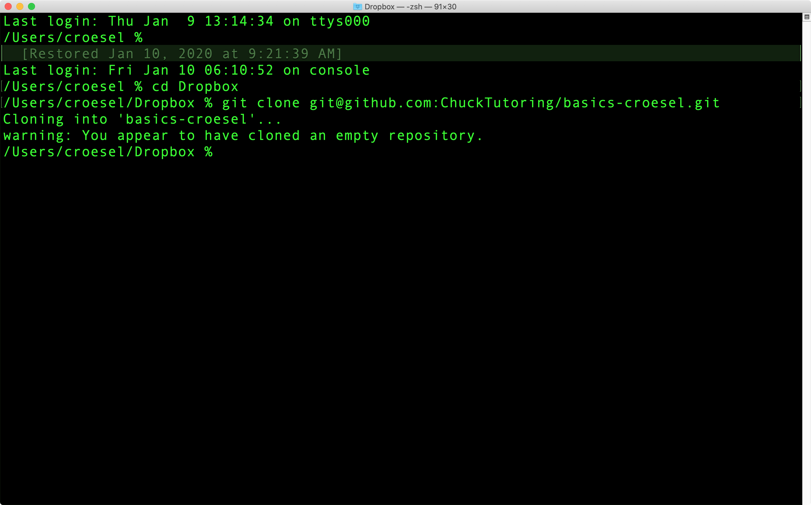

README
================
Chuck Roesel
1/10/2020

For Python tutoring we will use GitHub Classroom to collaborate and
share work and code examples. You should have a GitHub Classroom
invitation in your inbox. Login to GitHub, and join the classroom via
the link in the email. After accepting the invitation you should see
somthing like this:

